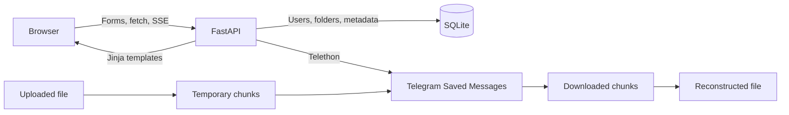

# DDDrive


[How to install ↓](#installation)

DDDrive is a personal cloud-storage experiment built with FastAPI and Telegram. Files are split into chunks and uploaded to Telegram Saved Messages, while SQLite stores users, folder structure, filenames, sizes, and Telegram message references.

The project combines an asynchronous Python backend with a server-rendered, responsive interface featuring nested folders, upload progress, file management, and light and dark themes.

## Features

- User registration and login
- Password hashing with bcrypt
- JWT authentication stored in an HTTP-only cookie
- File uploads to Telegram Saved Messages
- Adaptive file chunking based on file size
- Live upload progress using Server-Sent Events
- File download, rename, and deletion
- Nested folder creation and navigation
- Folder rename and deletion controls
- Files scoped to their current folder
- Responsive dashboard and authentication pages
- Persistent light and dark themes
- Drag-and-drop uploads

## How it works



Telegram stores the binary chunks. SQLite stores only the information required to reconstruct and organize them:

- owner UUID;
- original filename and size;
- parent folder;
- Telegram message IDs;
- chunk count and display metadata.

## Technology stack

| Layer | Technology |
|---|---|
| Web framework | FastAPI, Starlette, Uvicorn |
| Telegram client | Telethon |
| Database | SQLite, SQLAlchemy AsyncIO, aiosqlite |
| Authentication | PyJWT, bcrypt |
| Frontend | Jinja2, HTML, CSS, vanilla JavaScript |
| File I/O | aiofiles |
| Live progress | Server-Sent Events |

## Project structure

```text
DDDrive/
├── assets/                 # File-type icons and interface assets
├── core/
│   ├── GetFile.py          # Downloading chunks and reconstructing files
│   └── SendFile.py         # Splitting files and sending chunks
├── database/
│   ├── Database.py         # Async queries and persistence operations
│   └── models.py           # SQLAlchemy models
├── static/
│   ├── main.js             # Uploads, progress, modals, and interactions
│   └── style.css           # Responsive light/dark interface
├── templates/
│   ├── dashboard.html
│   └── login.html
├── main.py                 # Application, authentication, and routes
└── requirements.txt
```

## Requirements

- Python 3.14
- A Telegram account
- Telegram API credentials from [my.telegram.org](https://my.telegram.org/apps)

## Installation

Clone the repository:

```bash
git clone https://github.com/belzEnn/DDDrive.git
cd DDDrive
```

Create and activate a virtual environment:

```bash
python -m venv .venv
source .venv/bin/activate
```

On Windows PowerShell:

```powershell
python -m venv .venv
.venv\Scripts\Activate.ps1
```

Install the dependencies:

```bash
pip install -r requirements.txt
```

## Configuration

Create a `.env` file in the project root:

```env
API_ID=your_telegram_api_id
API_HASH=your_telegram_api_hash
SECRET_KEY=your_long_random_secret
```

Generate a suitable JWT secret with:

```bash
python -c "import secrets; print(secrets.token_urlsafe(48))"
```
> [!WARNING]
> Never commit `.env`, `storage.db`, or Telegram `.session` files.


## Running the application

Start the development server:

```bash
python main.py
```

Open [http://127.0.0.1:8000](http://127.0.0.1:8000).

During the first launch, Telethon may ask for your Telegram phone number, confirmation code, and two-factor authentication password. After successful authorization it creates a local session file, so later launches normally do not require another code.

## Typical workflow

1. Register a local DDDrive account.
2. Create folders or open the root directory.
3. Upload a file using the Upload button or drag and drop.
4. Follow the live progress indicator while chunks are sent to Telegram.
5. Download, rename, organize, or delete stored items from the dashboard.

## Data model

```text
User
├── Folder (parent_id → Folder.id)
│   └── Folder
└── File (folder_id → Folder.id or NULL)
```

A `NULL` parent or folder ID represents the root directory. Ownership is stored separately through each user's UUID.

## Current limitations

DDDrive is a portfolio project and development prototype, not a production storage service.

- Upload progress is stored in application memory and is intended for a single worker.
- SQLite schema changes currently require recreating the database or applying a manual migration.
- Large uploads temporarily require additional local disk space while chunks are prepared.
- Telegram rate limits and account restrictions apply.
- The local Telegram session must be protected like a credential.
- Automated tests and a production deployment configuration are not included yet.

## Possible improvements

- Alembic database migrations
- Streaming chunk upload with lower temporary disk usage
- Per-upload progress IDs and concurrent uploads
- Breadcrumbs for deeply nested folders
- Moving files and folders
- Trash and restore workflow
- Search, sorting, and pagination
- Automated API and authorization tests
- Docker and production deployment configuration

## License

This project is available under the [MIT License](LICENSE).
